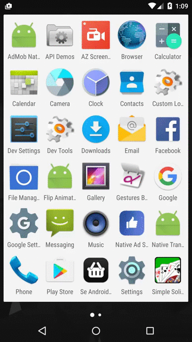

# FlipAnimation Sample

This sample demonstrates another implementation idea of full screen ad
unit during app launch.

In this sample the full screen ad unit is made from elements of an
[Native Ad][1], similar to the [NativeTransition][2] sample.

When the app launches, the brand image of the app is shown, and the ad
is loaded in the background. After a few seconds of waiting time, if the
ad is loaded, the brand image view flips over to show the ad. If there
is no ad then the user will be navigated to the main activity. By doing
so, the users' attention can be better captured in the center of the
screen, from the brand icon to the ad image.

Here are a few extra things we did in this sample:

- We used [Android Property Animation][3] to create the flipping animation
- We used [Blurry][4] to create the blur background of the ad view
- The flashy call to action button is created by using the included
`ShiningButton` custom `Button` class. Check the source code of it to
find out more details.

[1]: https://developers.facebook.com/docs/audience-network/android-native
[2]: ../NativeTransition
[3]: https://developer.android.com/guide/topics/graphics/prop-animation.html
[4]: https://github.com/wasabeef/Blurry