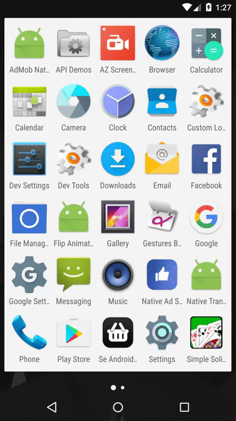

# Native Transition Sample

This sample demonstrates two topics:

## Full screen ad made from Native Ad elements

[Native Ad][1] is not limited to be the small component that looks like
the other elements on your app screen, it could also be used to make
your creative placement implementation. This sample demonstrates that
by using the elements you get from the Native Ad, you can totally
create your own styled full screen ad that matches your app design,
instead of using the fixed Facebook interstitial.

## Transition animation of open-app ad

With the flexibility of Native Ads, this sample also demonstrates how
to use the Android [shared elements transition animation][2] to
transition from the full screen ad into an ad unit on the main app
screen. By extending the attention span of users on this ad unit and
adding interests into the UI, you could test this idea with your app
to see if it helps improve your ad performance. You don't have to be
limited by this implementation, you could totally use more advanced
animations or whatever creative ideas that you have to fully utilize
the flexibility of a Native Ad.

[1]: https://developers.facebook.com/docs/audience-network/android-native
[2]: https://developer.android.com/training/material/animations.html
