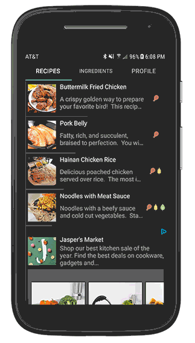
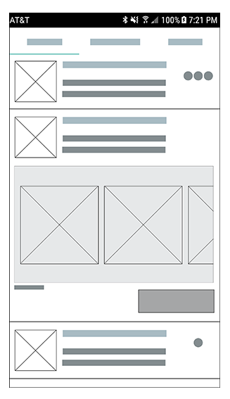

# RCPY - Native Ads RecyclerView example 

 

This is an example of integrating a [Native Ad](https://developers.facebook.com/docs/audience-network/android-native) in a Recycler View.

It's a sample recipe app where native ads will show up in the feed on the 5th entry.

Note that all the tabs will just load RecipeFragment - this is expected.

Code video walkthrough available here (in Part 2): [Monetizing with Audience Network](https://www.facebook.com/audiencenetwork/news-and-insights/watch-and-learn-monetizing-with-audience-network)

